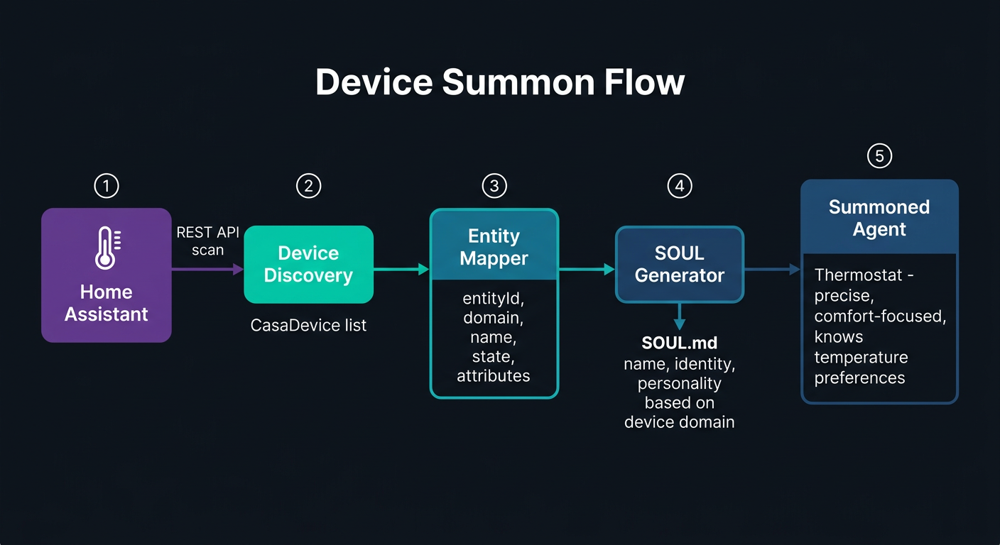
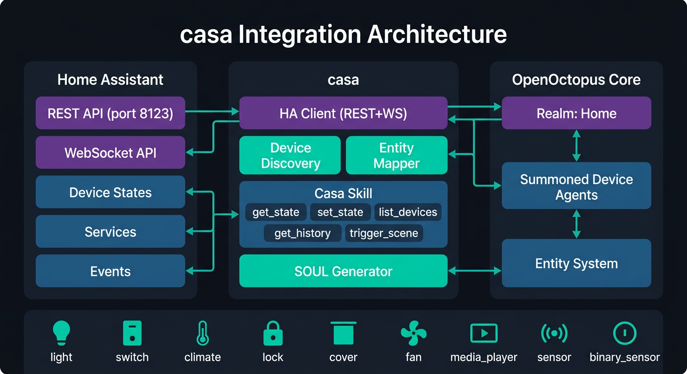

<p align="center">
  <picture>
    <source media="(prefers-color-scheme: light)" srcset="https://raw.githubusercontent.com/open-octopus/openoctopus.club/main/src/assets/brand/logo-dark.png">
    
  </picture>
</p>

<h3 align="center">casa</h3>

<p align="center">
  Smart home integration — summon your house into a living agent.
</p>

<p align="center">
  <a href="https://github.com/open-octopus/casa/blob/main/LICENSE"></a>
  <a href="#"></a>
  <a href="https://github.com/open-octopus/openoctopus"></a>
  <a href="https://discord.gg/openoctopus"></a>
</p>

---

> **Status: Alpha** — Home Assistant integration is implemented with REST API, WebSocket, device discovery, skill tools, and SOUL.md generation.

## What is casa?

**casa** is the smart home integration layer for [OpenOctopus](https://github.com/open-octopus/openoctopus). It bridges your Home Realm with Home Assistant, turning your house and its devices into summoned entities with memory and proactive behavior.

*Casa* means "home" in Spanish and Italian — a warm word for a warm integration.

## Installation

```bash
pnpm add @openoctopus/casa
```

## Configuration

Create a `.env` file (or set environment variables):

```bash
HA_URL=http://homeassistant.local:8123
HA_TOKEN=your_long_lived_access_token_here
```

Or configure programmatically:

```typescript
import { loadCasaConfig, createCasaSkill } from '@openoctopus/casa'

const config = loadCasaConfig({
  haUrl: 'http://homeassistant.local:8123',
  haToken: 'your-token',
  autoDiscover: true,
  pollInterval: 30,
  domains: ['light', 'switch', 'climate', 'lock'],
})

const skill = createCasaSkill(config)
```

## Usage

### Create the Casa Skill

```typescript
import { loadCasaConfig, createCasaSkill } from '@openoctopus/casa'

const config = loadCasaConfig()
const skill = createCasaSkill(config)

// skill.tools contains: casa_get_state, casa_set_state,
// casa_list_devices, casa_get_history, casa_trigger_scene
```

### Discover Devices

```typescript
import { HaClient, discoverDevices } from '@openoctopus/casa'

const client = new HaClient('http://ha.local:8123', 'token')
const devices = await discoverDevices(client, ['light', 'climate'])
```

### Generate SOUL.md for a Device

```typescript
import { generateDeviceSoul } from '@openoctopus/casa'

const soul = generateDeviceSoul(device)
// Returns a full SOUL.md with personality, behaviors, and memory notes
```

### Real-time Events via WebSocket

```typescript
import { HaWsClient } from '@openoctopus/casa'

const ws = new HaWsClient('http://ha.local:8123', 'token')
await ws.connect()
await ws.subscribeEvents((event) => {
  console.log(`${event.data.entity_id} changed`)
})
```

## Supported Device Types

| Domain | Description | Personality |
|--------|-------------|-------------|
| `light` | Lights and dimmers | Warm, friendly, mood-aware |
| `switch` | On/off switches | Reliable, straightforward |
| `climate` | Thermostats and HVAC | Precise, comfort-focused |
| `lock` | Smart locks | Vigilant, security-conscious |
| `cover` | Blinds and shutters | Measured, privacy-aware |
| `fan` | Fans and ventilation | Breezy, easygoing |
| `media_player` | Media devices | Entertaining, expressive |
| `sensor` | Sensors (temperature, etc.) | Observant, data-driven |
| `binary_sensor` | On/off sensors (motion, door) | Attentive, clear-cut |

<p align="center">
  
</p>

## SOUL.md Examples

See the `souls/` directory for example personality files:

- `souls/thermostat.soul.md` — A precise, comfort-focused thermostat
- `souls/smart-lock.soul.md` — A vigilant, security-conscious lock

## Architecture

<p align="center">
  
</p>

```
casa/
├── src/
│   ├── index.ts                  # Public API
│   ├── config.ts                 # Zod config schema
│   ├── types.ts                  # Device types, skill types
│   ├── ha/
│   │   ├── client.ts             # HA REST API client
│   │   ├── ws-client.ts          # HA WebSocket client
│   │   └── types.ts              # HA state/service/event types
│   ├── discovery/
│   │   ├── device-discovery.ts   # Scan HA devices
│   │   └── entity-mapper.ts      # HA entity to OpenOctopus mapping
│   ├── skill/
│   │   ├── casa-skill.ts         # SkillDefinition factory
│   │   └── tools/                # Individual tool implementations
│   └── soul/
│       └── device-soul-generator.ts  # SOUL.md generation
└── souls/                        # Example SOUL.md files
```

## Development

```bash
pnpm install
pnpm build          # Build with tsdown
pnpm test           # Run tests with vitest
pnpm test:watch     # Watch mode
pnpm typecheck      # TypeScript check
pnpm lint           # oxlint
```

## Related Projects

| Project | Description |
|---------|-------------|
| [openoctopus](https://github.com/open-octopus/openoctopus) | Core monorepo |
| [coral](https://github.com/open-octopus/coral) | Cross-realm workflow engine |
| [realms](https://github.com/open-octopus/realms) | Official realm packages |

## Contributing

Join [The Reef (Discord)](https://discord.gg/openoctopus) to discuss smart home integration ideas, or open an issue with use cases.

See [CONTRIBUTING.md](https://github.com/open-octopus/.github/blob/main/CONTRIBUTING.md) for general guidelines.

## License

[MIT](LICENSE)
